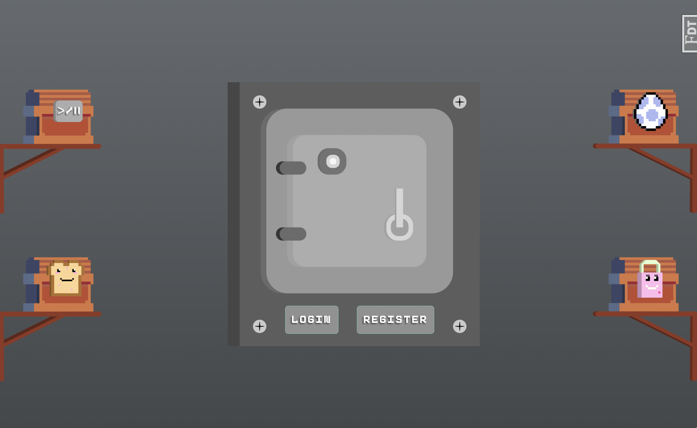
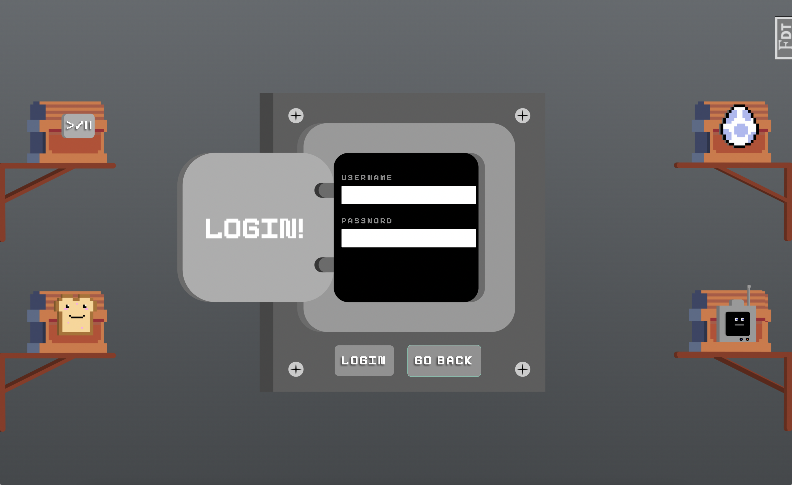
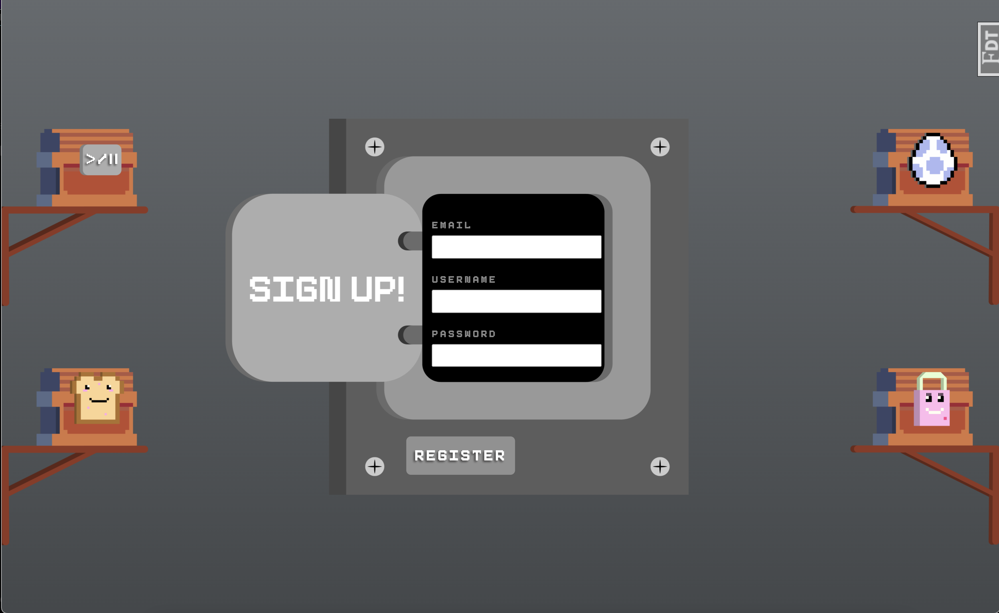
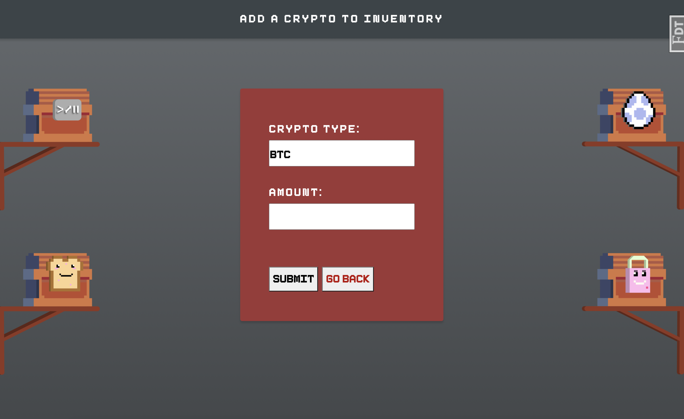
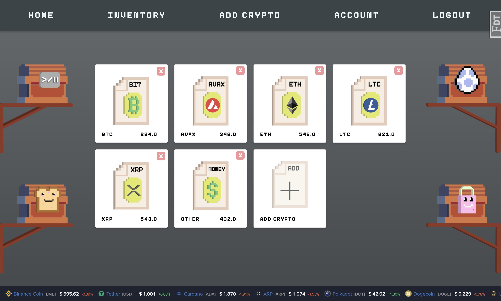
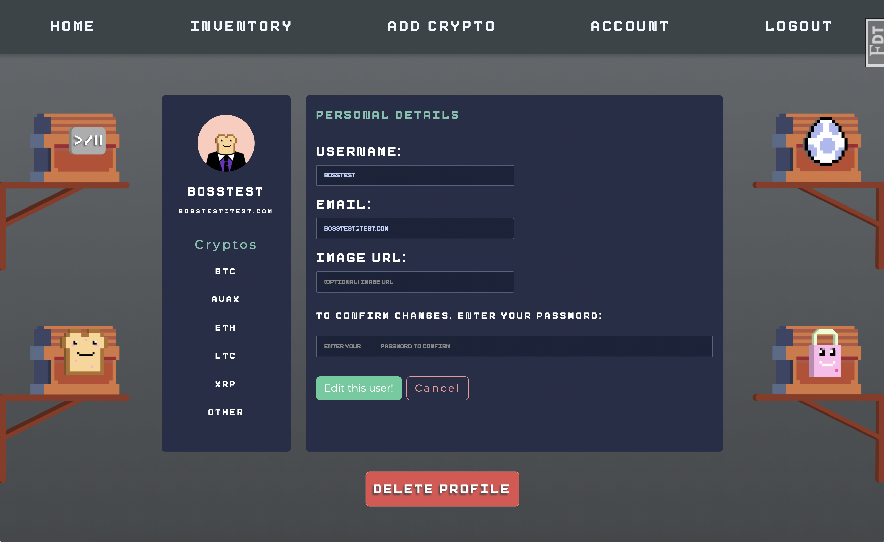
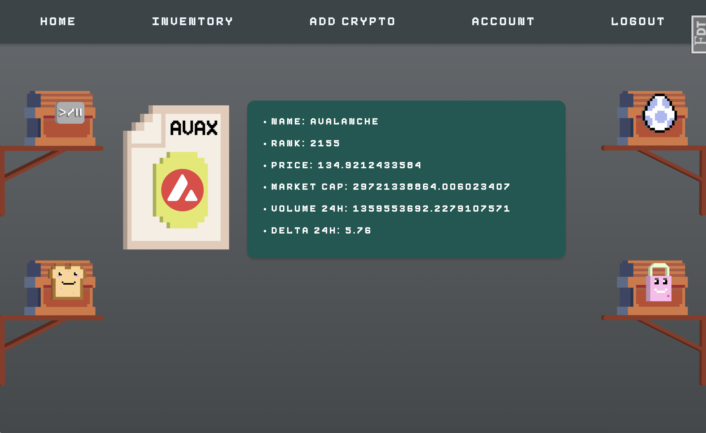

# Eight-Bit-Banking

* an Eight Bit themed banking app that stores crypto currencies in a "MineCraft" like inventory

# Live URL:  

[https://eight-bit-banking.herokuapp.com/](https://eight-bit-banking.herokuapp.com/)

# Demo:

* No need to create an account just Login with test account on Heroku:

* username: "TestME" 
<br />
* password: "TesTTEST"

# Installation:

After creating a virtual environment, run: 
<br />
```pip install -r requirements.txt```
<br />
```source venv/bin/activate```
<br />
```flask run```


# API-Usage:

* fetches from Coinlib API and responds with Symbol, Name, Rank, Price, Market Cap, Volume 24h, and Delta 24h for specified crypto insertion.

# Screen-shots:
















# Known Issues: 

* There are some bottlenecking issues that I need to address. Some of the CSS elements are slow to run upon page loading. API info is not revealed in the Live URL for heroku.